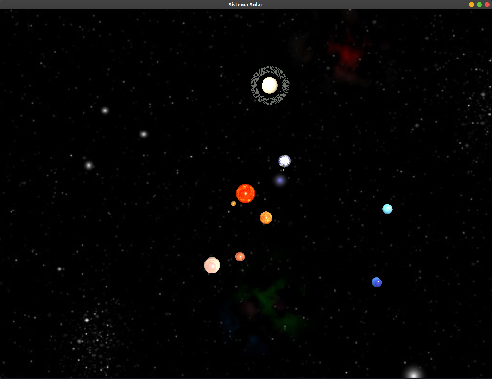

<h2 align="center">
    
Sistema Solar 🪐🌍☀️

</h2>

     
    
    </a>
     

 TODO:
- ✔️ Iluminación
- ✔️ Anillos de Saturno
- ✔️ Luna
- ✔️ Fondo estrellado
- ⬜️ Cinturon de asteroides
- ⬜️ Estrellas aleatorias
- ⬜️ Desplazamiento con el mouse
- ⬜️ Normal Mapping

## ℹ️ Instrucciones

* Para compilar ejecute desde el terminal `./build.sh`.
* Para ejecutar `./a.out`